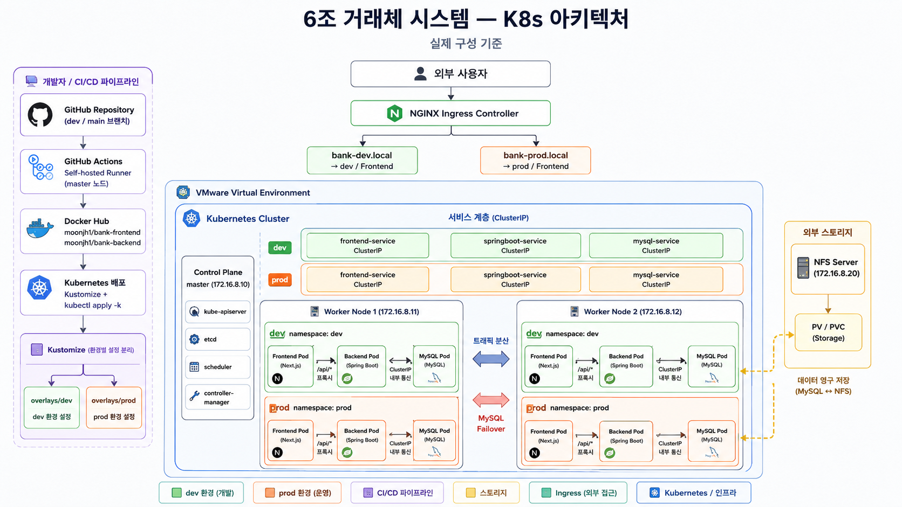
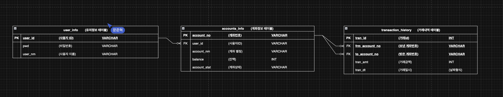
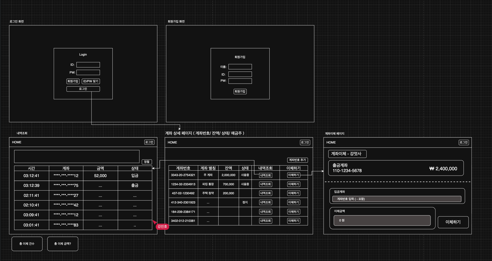

# 인뿌볼 — 계좌이체 시스템

> 멋쟁이 사자처럼 클라우드 엔지니어링 부트캠프 6조 1차 프로젝트

---

## 팀원

| 역할 | 이름 |
|------|------|
| 팀장 | 이채영 |
| 부팀장 | 나윤준 |
| 팀원 | 문준혁 |
| 팀원 | 강진호 |

---

## 프로젝트 소개

쿠버네티스 기반 클라우드 인프라 위에 배포하는 **인터넷 뱅킹 계좌이체 시스템**입니다.  
사용자별 계좌 조회, 계좌 이체, 거래내역 조회 기능을 제공합니다.

### 주요 기능

| 기능 | 설명 |
|------|------|
| 로그인 / 회원가입 | 세션 기반 인증, BCrypt 비밀번호 해시 |
| 계좌 조회 | 보유 계좌 목록 및 총 잔액 확인 |
| 계좌 이체 | 출금 계좌 선택 → 입금 계좌번호 입력 → 이체 실행 |
| 거래내역 조회 | 계좌별 이체 내역 (일시, 금액, 상대 계좌) 확인 |

---

## 기술 스택

### 애플리케이션

| 영역 | 기술 |
|------|------|
| Frontend | Next.js 14 (App Router, TypeScript) |
| Backend | Spring Boot 3 + MyBatis |
| Database | MySQL 8 |

### 인프라

| 영역 | 기술 |
|------|------|
| 컨테이너 오케스트레이션 | Kubernetes (kubeadm) |
| 네트워크 플러그인 | Calico |
| 인그레스 | NGINX Ingress Controller |
| 스토리지 | NFS PersistentVolume |
| 매니페스트 관리 | Kustomize (base / overlays) |
| CI/CD | GitHub Actions (self-hosted runner) |
| 이미지 레지스트리 | Docker Hub |

---

## 문서

| 문서 | 링크 |
|------|------|
| 시스템 아키텍처 | [docs/아키텍처.png](docs/아키텍처.png) · [HTML 상세](docs/architecture.html) |
| 화면 정의서 | [docs/화면정의서.png](docs/화면정의서.png) · [HTML 상세](docs/screen-definition.html) |
| ERD | [docs/ERD.png](docs/ERD.png) · [HTML 상세](docs/erd.html) |

---

## 시스템 아키텍처



### 트래픽 흐름

```
브라우저
  └── NGINX Ingress Controller
        ├── bank-dev.local   → dev 네임스페이스 / frontend Pod :3000
        └── bank-prod.local  → prod 네임스페이스 / frontend Pod :3000

Frontend Pod (Next.js)
  └── /api/* → rewrites → springboot-service:8080 (ClusterIP)
                                  └── mysql-service:3306 (ClusterIP)
```

### 클러스터 구성

| 역할 | 호스트명 | IP |
|------|----------|----|
| Control Plane | master | 172.16.8.10 |
| Worker Node 1 | node1 | 172.16.8.11 |
| Worker Node 2 | node2 | 172.16.8.12 |
| NFS Server | — | 172.16.8.20 |

---

## ERD



```
user_info
├── user_id   VARCHAR(20) PK
├── user_nm   VARCHAR(20)
└── pwd       VARCHAR(255)

accounts_info
├── account_no    VARCHAR(30) PK
├── user_id       VARCHAR(20) FK → user_info
├── balance       INT
├── account_nm    VARCHAR(30)
└── account_stat  VARCHAR(20)

transaction_history
├── tran_id        INT PK AUTO_INCREMENT
├── frm_account_no VARCHAR(30) FK → accounts_info
├── to_account_no  VARCHAR(30) FK → accounts_info
├── tran_amt       INT
└── tran_dt        DATETIME
```

---

## 화면 정의서



| 화면 | 경로 | 설명 |
|------|------|------|
| 로그인 | `/login` | 아이디/비밀번호 입력, Enter 키 지원 |
| 회원가입 | `/signup` | 신규 계정 생성 |
| 계좌 목록 | `/accounts` | 보유 계좌 + 총 잔액, 내역/이체 버튼 |
| 계좌 이체 | `/transfer` | 출금 계좌 선택, 입금 계좌번호 입력, 금액 입력 |
| 거래 내역 | `/transactions` | 선택 계좌의 이체 내역 목록 |

---

## 프로젝트 구조

```
cloud_engineering_6team_firstProject/
├── app/
│   ├── backend/                        # Spring Boot 백엔드
│   │   ├── Dockerfile
│   │   ├── build.gradle
│   │   └── src/main/
│   │       ├── java/com/exam/
│   │       │   ├── DemoApplication.java
│   │       │   ├── config/             # CorsConfig, PasswordConfig
│   │       │   ├── controller/         # AccountController, TransactionController, UserController
│   │       │   ├── dto/                # AccountDTO, TransactionDTO, UserDTO
│   │       │   ├── mapper/             # MyBatis 인터페이스
│   │       │   └── service/            # 인터페이스 + Impl 쌍
│   │       └── resources/
│   │           ├── application.yml
│   │           ├── schema.sql          # DDL
│   │           ├── data.sql            # 초기 데이터
│   │           └── com/exam/mapper/    # MyBatis XML Mapper
│   └── frontend/                       # Next.js 프론트엔드
│       ├── Dockerfile
│       ├── app/
│       │   ├── login/page.tsx
│       │   ├── signup/page.tsx
│       │   ├── accounts/page.tsx
│       │   ├── transfer/page.tsx
│       │   └── transactions/page.tsx
│       ├── components/
│       │   └── SiteNav.tsx
│       └── lib/api/                    # fetch 클라이언트 (client.ts 기반)
├── mainfests/                          # Kubernetes 매니페스트
│   ├── base/                           # 공통 리소스 (Deployment, Service)
│   └── overlays/
│       ├── dev/                        # 개발 환경 패치
│       └── prod/                       # 운영 환경 패치
├── network/
│   ├── calico/                         # Calico CNI 설정
│   ├── db/                             # DB 초기화 SQL
│   └── storage/                        # PV / PVC YAML
├── docs/                               # 문서 (아키텍처, ERD, 화면정의서)
└── .github/workflows/deploy.yml        # CI/CD 워크플로우
```

---

## CI/CD

```
main 브랜치 push  →  prod 네임스페이스 자동 배포  (이미지 태그: latest)
dev  브랜치 push  →  dev  네임스페이스 자동 배포  (이미지 태그: dev)
```

**흐름**

1. GitHub Actions self-hosted runner (master 노드 172.16.8.10) 트리거
2. `docker/build-push-action` 으로 이미지 빌드 후 Docker Hub 푸시
3. `kubectl apply -k mainfests/overlays/{overlay}/` 적용
4. `kubectl rollout restart` 로 Pod 재시작 및 완료 대기

**필요 GitHub Secrets**

| Secret | 설명 |
|--------|------|
| `DOCKER_USERNAME` | Docker Hub 계정 (`moonjh1`) |
| `DOCKER_PASSWORD` | Docker Hub 액세스 토큰 |

---

## 로컬 실행

### 백엔드

```bash
cd app/backend
./gradlew bootRun
# http://localhost:8080
```

### 프론트엔드

```bash
cd app/frontend
npm install
npm run dev
# http://localhost:3000
```

> 로컬에서는 `BACKEND_URL` 환경변수가 없으므로 `http://springboot-service:8080` 으로 fallback됩니다.  
> 로컬 개발 시 `next.config.mjs` 의 `rewrites` destination을 `http://localhost:8080` 으로 임시 변경하세요.

---

## 쿠버네티스 배포 (수동)

```bash
# dev 환경
kubectl apply -k mainfests/overlays/dev/

# prod 환경
kubectl apply -k mainfests/overlays/prod/
```

**접속 주소**

| 환경 | 방식 | 주소 |
|------|------|------|
| dev | NodePort | `http://172.16.8.10:30081` |
| prod | NodePort | `http://172.16.8.10:30080` |
| dev | Ingress | `http://bank-dev.local` |
| prod | Ingress | `http://bank-prod.local` |
